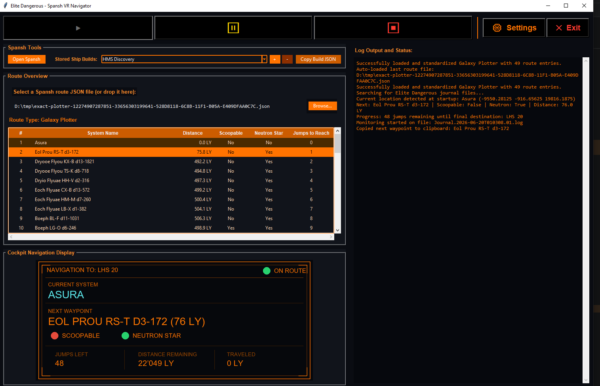
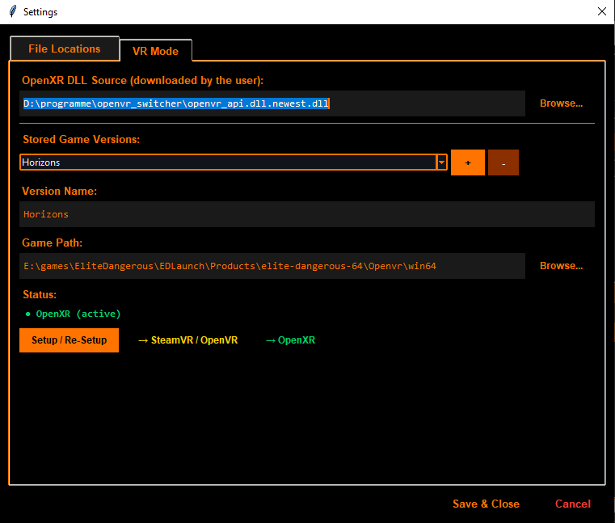
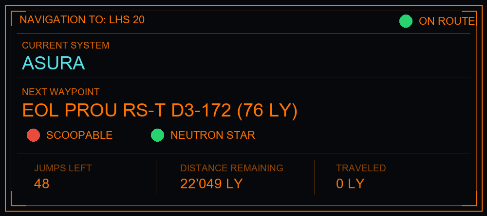

# Elite Dangerous - Spansh VR Navigator

A lightweight desktop helper for **Elite Dangerous** VR navigation.

This tool reads **Spansh route JSON files**, monitors your **Elite Dangerous journal logs**, copies the **next waypoint** to the clipboard, and generates a **navigation image** for use with **OpenKneeboard**.

---

## Table of Contents

- [Elite Dangerous - Spansh VR Navigator](#elite-dangerous---spansh-vr-navigator)
  - [Table of Contents](#table-of-contents)
  - [Features](#features)
  - [Required Downloads](#required-downloads)
  - [What It Does](#what-it-does)
  - [Typical Workflow](#typical-workflow)
  - [Installation](#installation)
    - [Requirements](#requirements)
    - [Python packages](#python-packages)
    - [Run](#run)
    - [Build EXE](#build-exe)
    - [requirements.txt](#requirementstxt)
  - [Screenshots / Images](#screenshots--images)
    - [Main Window](#main-window)
    - [VR Settings](#vr-settings)
    - [Generated Navigation Image](#generated-navigation-image)
  - 
  - [Example VoiceAttack Workflow](#example-voiceattack-workflow)
  - [Notes](#notes)
  - [Known Issues](#known-issues)
  - [Recommended VR Setup](#recommended-vr-setup)
  - [Disclaimer](#disclaimer)

---

## Features

- Load and parse **Spansh route JSON** files
- Supports multiple Spansh route types
- Monitors the latest **Elite Dangerous journal**
- Detects your current system after startup
- Tracks route progress
- Copies the **next waypoint** to the clipboard
- Generates a **VR-friendly navigation image**
- Displays the image inside the app
- Supports named **VR game versions**
- Lets you store **Ship Build JSON** snippets

---

## Required Downloads

The following tools/files must be installed or downloaded manually:

- **OpenXR DLL**
  <https://znix.xyz/OpenComposite/download.php?arch=x64&branch=openxr>

- **OpenKneeboard**
  <https://openkneeboard.com/>

- **VoiceAttack** or a similar clipboard/input automation tool
  <https://voiceattack.com/>

---

## What It Does

The application is designed to make **VR route navigation** in Elite Dangerous more comfortable.

It continuously tries to determine the **next waypoint** of the loaded Spansh route based on your current location.

Whenever possible, it:

- identifies the next route target
- copies that system name to the **clipboard**
- generates a **navigation image**
- updates the image for viewing in **OpenKneeboard**

---

## Typical Workflow

1. Start the app
2. Open **Settings**
3. Configure:
   - journal directory
   - kneeboard image output file
   - OpenXR DLL source
   - one or more stored game versions
4. Load a **Spansh route JSON**
5. Click **Start**
6. Jump normally in Elite Dangerous
7. After each jump, the app updates:
   - current progress
   - next waypoint
   - navigation image

---

## Installation

### Requirements

- Windows
- Python 3.10+ recommended
- Elite Dangerous

### Python packages

Install the required Python packages:

~~~bash
pip install -r requirements.txt
~~~

> `tkinter` is usually included with standard Python on Windows.

### Run

~~~bash
python ed_spansh_helper.py
~~~

### Build EXE

~~~bash
pyinstaller --noconsole --onefile ed_spansh_helper.py
~~~

### requirements.txt

~~~txt
Pillow
tkinterdnd2
~~~

---

## Screenshots / Images

### Main Window

### VR Settings

### Generated Navigation Image

---

## Example VoiceAttack Workflow

This app copies the **next waypoint** to the clipboard, but it does **not** paste it into Elite Dangerous by itself.

A common setup is to use **VoiceAttack** to send the clipboard contents into the galaxy map search field.

Typical approach:

1. Open the galaxy map
2. Focus the search field
3. Trigger a VoiceAttack command
4. Let VoiceAttack send:
   - paste shortcut
   - confirm / search input
   - optional extra key presses for your personal workflow

This way, the waypoint copied by this tool can be inserted into the game with minimal manual work.

> The exact VoiceAttack profile depends on your own keybinds and preferred galaxy map workflow.

---

## Notes

- The app does **not** paste waypoints into Elite Dangerous by itself
- It only copies the next waypoint to the **clipboard**
- To paste it into the galaxy map, use **VoiceAttack** or a similar tool
- The generated PNG can be displayed with **OpenKneeboard**
- VR DLL switching may require **administrator rights**
- After a game update, **VR setup may need to be run again**

---

## Known Issues

- Very large journal files may slow down startup location detection
- VR DLL switching can fail if the game folder is protected
- After Elite Dangerous updates, the VR setup may need to be run again
- Clipboard-based workflows depend on external tools such as VoiceAttack
- Route matching may be less accurate if the current system is not directly part of the loaded route

---

## Recommended VR Setup

- **This app** for route tracking and image generation
- **OpenKneeboard** for displaying the image in VR
- **VoiceAttack** for inserting clipboard text into the galaxy map
- **OpenXR DLL / OpenComposite** for OpenXR mode

---

## Disclaimer

This is a helper utility for Elite Dangerous players.

Use it at your own risk and always verify your paths, DLL files, and automation setup.
