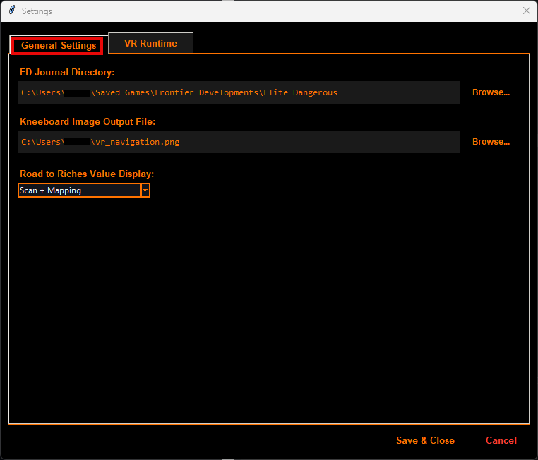
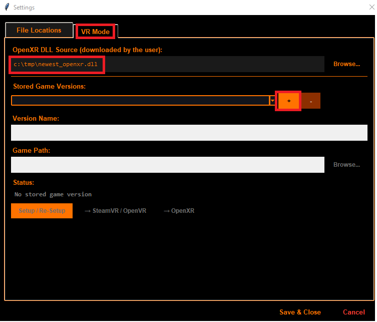
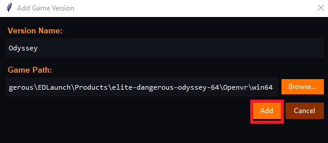
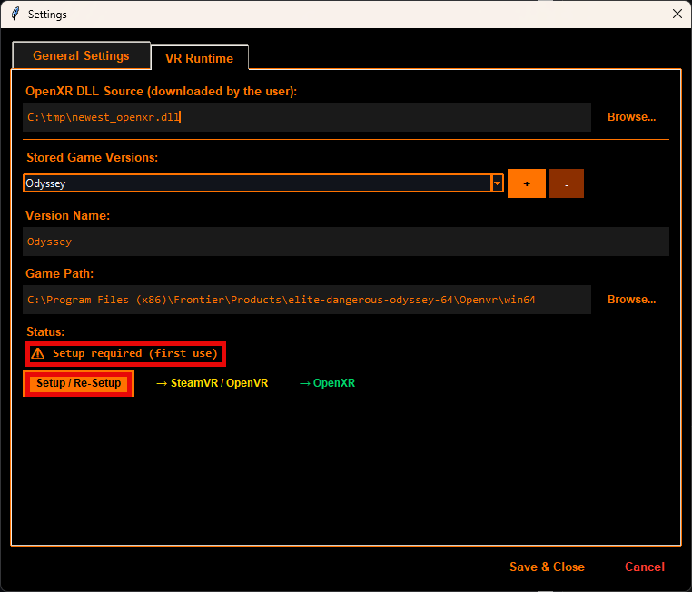
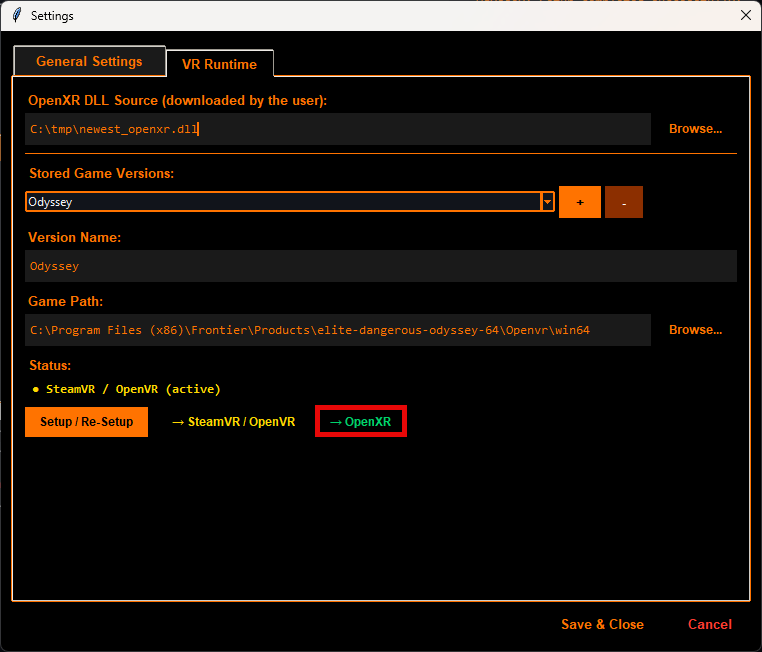

# Elite Dangerous - Spansh VR Navigator


A lightweight desktop helper for **Elite Dangerous** VR navigation.

This tool reads **Spansh route JSON files**, monitors your **Elite Dangerous journal logs**, copies the **next waypoint** to the clipboard, and generates a **navigation image** for use with **OpenKneeboard**.

---

## Table of Contents

- [Elite Dangerous - Spansh VR Navigator](#elite-dangerous---spansh-vr-navigator)
  - [Table of Contents](#table-of-contents)
  - [Motivation \& Background](#motivation--background)
    - [Development Note](#development-note)
  - [Features](#features)
  - [Screenshots](#screenshots)
    - [Main Window](#main-window)
    - [Generated Navigation Image](#generated-navigation-image)
  - [Prerequisites \& Downloads](#prerequisites--downloads)
  - [Installation](#installation)
    - [Option 1: Run the Executable (Recommended for users)](#option-1-run-the-executable-recommended-for-users)
    - [Option 2: Run from Source (For developers)](#option-2-run-from-source-for-developers)
  - [Initial Setup (Do This Once)](#initial-setup-do-this-once)
    - [1. Folder Configuration](#1-folder-configuration)
    - [2. VR \& OpenXR Setup](#2-vr--openxr-setup)
    - [3. OpenKneeboard Quickstart](#3-openkneeboard-quickstart)
    - [4. VoiceAttack Automation (Optional but Recommended)](#4-voiceattack-automation-optional-but-recommended)
  - [Daily Workflow (How to Use)](#daily-workflow-how-to-use)
  - [Tips, Limitations \& Known Issues](#tips-limitations--known-issues)
  - [Disclaimer](#disclaimer)
  - [License](#license)

---

## Motivation & Background

I originally created this tool to solve a specific pain point in Virtual Reality. While **spansh.co.uk** is amazing for route planning, using it in VR is tedious. Manually copying and pasting each waypoint meant constantly lifting the VR headset. This tool provides a seamless solution to keep you fully immersed.

### Development Note

This project was built with significant assistance from Large Language Models (LLMs) for writing, refactoring, and restructuring the codebase based on my custom logic and ideas.

---

## Features

- **Automated Tracking:** Detects your next Spansh waypoint based on current in-game location.
- **Clipboard Sync:** Automatically copies the next system name to your clipboard.
- **Kneeboard Integration:** Generates a real-time navigation image for VR overlay software.

---

## Screenshots

### Main Window


### Generated Navigation Image


---

## Prerequisites & Downloads

You will need to download and install the following tools:

1. **OpenXR DLL (64-bit):** [Download OpenComposite DLL](https://znix.xyz) (Replaces SteamVR for better performance).
2. **OpenKneeboard:** [Official Website](https://openkneeboard.com) (To view the nav image in VR).
3. **VoiceAttack:** [Official Website](https://voiceattack.com) (Recommended for automated clipboard pasting).

---

## Installation

### Option 1: Run the Executable (Recommended for users)

Run the pre-compiled binary from the repository: `dist/ed_spansh_helper.exe`.

> [!WARNING]
> **Antivirus False Positives:** Executables built with `pyinstaller` often trigger false malware warnings in Windows Defender. This is a common issue with Python-to-EXE converters. The tool contains no malicious code. If you prefer, use Option 2 to run from source.

### Option 2: Run from Source (For developers)

1. Ensure Python 3.10+ is installed.
2. Install dependencies:

   ```bash
   pip install -r requirements.txt
   ```

3. Run the app:

   ```bash
   python ed_spansh_helper.py
   ```

4. (Optional) Build your own EXE:

   ```bash
   pyinstaller --noconsole --onefile ed_spansh_helper.py
   ```

---

## Initial Setup (Do This Once)

Follow these steps to configure the application for your first run.

### 1. Folder Configuration

1. Launch the application and open **Settings**.
2. **Journal Directory:** Set this to your Elite Dangerous journal path.
   - *Default:* `C:\Users\YOUR_USER\Saved Games\Frontier Developments\Elite Dangerous`
3. **Kneeboard Output File:** Choose a path where the helper should save the generated PNG image (e.g., `C:\Games\ED_Nav.png`).
   

### 2. VR & OpenXR Setup

1. Switch to the **VR Mode** tab in Settings.
2. **OpenXR DLL Source:** Select the `openxr.dll` file you downloaded in the prerequisites step.
   
3. **ED OpenVR Folder:** Select the folder containing your game's original `openvr_api.dll`.
   - *Steam Odyssey Default:* `...\SteamApps\common\Elite Dangerous\Products\elite-dangerous-odyssey-64\Openvr\win64`
   
4. Click **Setup/Re-Setup** when the warning appears.
   
5. Select **OpenXR** to swap the DLLs.
   

> [!NOTE]
> This configuration swaps your VR runtime to OpenXR, which usually grants a significant FPS boost. It creates backups of your original files (`.steamvr`). Steam overlays like OVR Toolkit will no longer work.

### 3. OpenKneeboard Quickstart

1. Open **OpenKneeboard Settings** -> **Tabs**.
2. Add a new **Image Directory** or **Single Image** tab.
3. Link it directly to your **Kneeboard Output File** PNG path configured in Step 1.
4. Bind a VR controller shortcut or hotkey in OpenKneeboard to toggle the kneeboard visibility in-game.

### 4. VoiceAttack Automation (Optional but Recommended)

The tool copies the next system to the clipboard but does **not** paste it into the game. Set up a VoiceAttack command with this macro workflow:

1. Open Galaxy Map (In-game shortcut).
2. Focus the search field.
3. **VoiceAttack Action:** Press `Ctrl + V` (Paste).
4. **VoiceAttack Action:** Press `Enter` (Search / Plot Route).

---

## Daily Workflow (How to Use)

Once the initial setup is done, your gameplay loop looks like this:

1. Generate your route on [spansh.co.uk](https://spansh.co.uk) and export it as a **JSON file**.
2. Start this app and click **Load Route** to import the JSON.
3. Click **Start** to begin monitoring.
4. Launch Elite Dangerous and open OpenKneeboard.
5. **Every time you jump:**
   - The app automatically updates your progress.
   - The OpenKneeboard image refreshes with your next targets.
   - The next waypoint system name is copied to your clipboard.
   - Trigger your VoiceAttack command inside the Galaxy Map to quickly paste the next route destination.

---

## Tips, Limitations & Known Issues

- **Admin Rights:** Swapping the VR DLL files may require running this application as an Administrator.
- **Game Updates:** Whenever Elite Dangerous updates via Steam/Frontier, you might need to re-run the VR Setup step.
- **Large Journals:** Very large journal logs can cause a slight delay in detecting your initial starting location.
- **Route Accuracy:** Deviation from the planned Spansh route might temporarily lower route-matching accuracy until you return to the path.

---

## Disclaimer

This is an independent helper utility. Use it at your own risk. Third-party tools mentioned (**spansh.co.uk**, **OpenKneeboard**, **VoiceAttack**, **OpenComposite**) are the property of their respective creators and are not affiliated with this project.

## License

This project is licensed under the **Creative Commons Attribution-NonCommercial-ShareAlike 4.0 International (CC BY-NC-SA 4.0)** License. See the full [Creative Commons Legal Code](https://creativecommons.org) for details.
